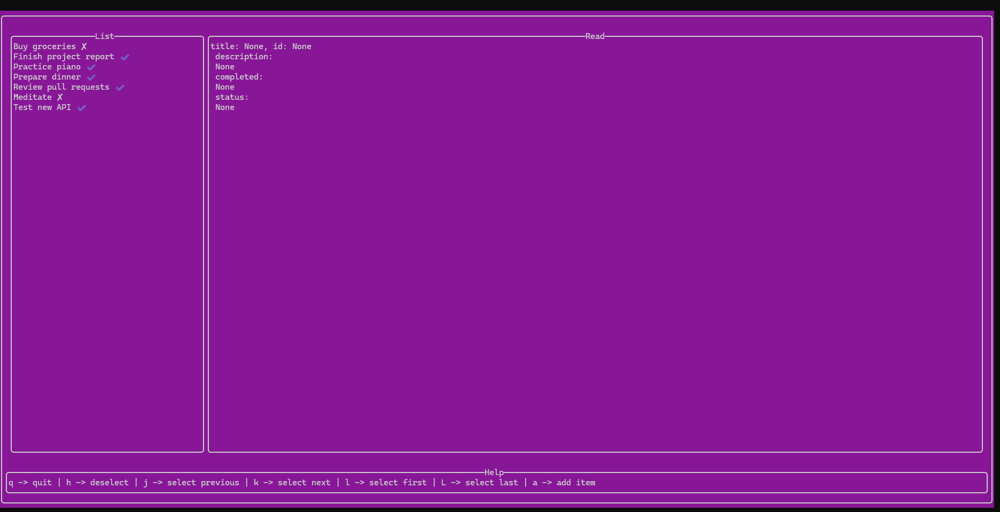

# Rust Todo TUI Application

A simple terminal-based todo application built with Rust and Ratatui.

## Prerequisites

- [Rust](https://www.rust-lang.org/tools/install) (includes `cargo`)
- Clone this repository

## How to Run

1. Install Rust and Cargo if you haven't already:
   ```
   curl --proto '=https' --tlsv1.2 -sSf https://sh.rustup.rs | sh
   ```

2. Clone the repository and navigate to the project folder:
   ```
   git clone <your-repo-url>
   cd todo
   ```

3. Run the application:
   ```
   cargo run
   ```

## Screenshot



---

**Note:**  
- Todos are stored in `data/data.json`.
- Keyboard shortcuts are shown at the bottom of the app.

